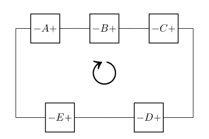
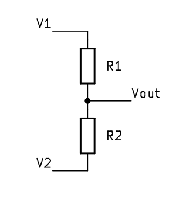
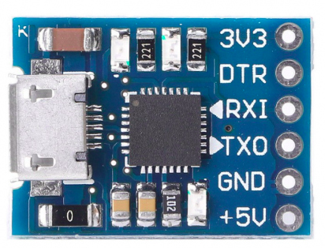

# 01 - Hardware Introduction

We will use [KiCad](https://www.kicad.org/) Electronics Design Suite for the electronic schematics.

## Resources
1. [Getting Started in KiCad](https://docs.kicad.org/7.0/en/getting_started_in_kicad/getting_started_in_kicad.html) 
2. **Charles Platt**, *Encyclopedia of Electronic Components*, Volumes 1, 2, 3 

## Basic electronics

### Definitions

#### Electronic voltage

Electronic voltage represents the potential difference between two points in a circuit and it's proportional to the energy required to move an electric charge between the two points.

$$
U = \frac{L}{Q}
$$

U = Electromotive voltage;  
L = Mechanical work of electric force;  
Q = Electric charge; 

The unit of measurement of electric voltage in the SI[^si] is the **Volt**(V)

$$
[U]_{SI} = V(Volt) \\
[L]_{SI} = J(Joule) \\
[Q]_{SI} = C(Coulomb) \\
$$

:::info

Electronic voltage is always measured between two points in a circuit. In general, voltages are measured against a reference point called circuit mass **(GND)**. Circuit mass is a convention and represents the point which potential is consider null. 

:::

#### Electric resistance

Electrical resistance is a physical quantity that expresses the property of a material to oppose the passage of electric current. The SI[^si] unit of resistance is the **Ohm**, noted &ohm;.

$$
[R]_{SI} = \Omega(Ohm)
$$

#### Intensity of electric current

The intensity of the electric current, also called the electric current, is a scalar physical quantity equal to the variation of the electric charge that crosses the section of a conductor in the unit of time. The unit of measurement in SI[^si] is the **Ampere**(A).

$$
[I]_{SI} = A(Ampere)
$$

### Ohm's law

The intensity(I) of the electric current passing through a resistor is directly proportional to the voltage(U) applied to the resistor and inversely proportional to its resistance value(R).

$$
I = \frac{U}{R};
$$

I = intensity of electric current(A)   
U = electrical voltage(V)   
R = circuit's resistance(&ohm;)

### Kirchhoff's First Law

The sum of currents flowing into a junction is always equal to the sum of currents flowing out of the same junction.

$$
\sum_{k=1}^{n} I_k = 0
$$

$$
I_1 + I_2 = I_3 + I_4 + I_5 \\
I_1 + I_2 - I_3 - I_4 - I_5 = 0
$$

### Kirchhoff's Second Law

Around any closed loop in a circuit, the directed sum of potential differences across components is zero.

$$
\sum_{k=1}^{n} U_k = 0
$$

$$
-U_A - U_B - U_C + U_D + U_E = 0
$$

### Voltage divider

There are many types of voltage dividers, being named according to the type of component elements: resistive divider, capacitive divider, compensated divider, etc...   
The **resistive voltage divider** is obtained by applying a voltage $$E$$ to a group of resistors in series and thus a fraction of the voltage applied to one of the resistors of the group can be obtained.

$$
V_{out} = V_{in} * \frac{R_{2}}{R_{1} + R_{2}};
$$

:::warning
Voltage divider can be considered a power source only if it operates in the empty state. It is **not recommended** to use a voltage divider to supply a circuit. It can be used to provide reference points.
:::

#### What happens if we use the voltage divider to supply a circuit.

We consider a voltage divider that provides $$3V3$$ from a $$5V$$ power source $$E$$ and a load resistance, $$R_s$$, representing the current consumption of a sensor or a circuit that needs to be supplied at $$3V3$$.

From Kirchhoff's First Law, the current through $$R_1$$ must be equal to the sum of the current through $$R_2$$ and $$R_s$$. 

$$
I_{R_1} = I_{R_2} + I_{R_S} 

U = U_{E} * \frac{R_{2} || R_{S}}{R_{1} + R_{2} || R_{S}};
$$

The output voltage depends on the current intensity through $$R_s$$, on the current consumption of the circuit that needs to be supplied at $$3V3$$. This is not a viable power supply solution.

:::note
Beside the instability of the voltage divider with a load, the power rating for the $$R_1$$ must be suitable.

$$
P_{R_1} = U_{R_1} * I_{R_1}
$$

The power dissipation on the resistor is directly proportional with the current through the resistor. Resistor are fabricated with predefined power ratings, most common $$\frac{1}{4}W$$, `1/2W`, `1W`. 

:::

:::info
In case we want to use the voltage divider between two chosen voltage values, we can use the generalized formula:

$$
V_{out} = ( V_{1} - V_{2} ) * \frac{R_{2}}{R_{1} + R_{2}};
$$

:::

### LEDs

LEDs - Light Emitting Diode - also called electroluminescent diodes - emit light when they are directly polarized. Not to be confused with light bulbs as they have radically different methods of operation.   

LEDs can be used as indicator lights (often used in various appliances to signal that the appliance is on and doing something), or for illumination, in which case power LEDs are used. In the lab, LEDs are used to indicate the status of a pin.

#### Calculation of current limiting resistor

To use an LED for the purpose of indicating the status of a pin (rather said to indicate the presence of voltage), the current through the LED must be limited. This can be done most simply by stringing a resistor with the LED.   

An LED is designed to operate at a nominal current (ex: 10mA). The voltage drop at this current across low power indicator LEDs is given by the chemistry of the LED (this also gives the color of the LED). In the lab, since we are using such a low current LED, we can power it directly from the logic pins of the MCU.

$$
R_{1} = \frac{(U_{pin} - U_{led})}{I_{led}}
$$

#### Example:

If the MCU has a pin voltage of 3.3V, also noted as 3V3, to light up an LED with a nominal current of 10mA and a voltage drop of 2V we need 
a resistance of 130 &ohm;.

:::note
We can use a resistor with a higher resistance value. The nominal current will light up the LED at it's maximum brightness. For status LEDs we can pick a resistance even 10 times bigger and the LED will light up slightly. 
:::

:::danger
If there is no resistor in the circuit, the resistance will be almost `0`, the current will tend to `infinity`, meaning a short circuit. This will absolutely burn the LED and make it unusable, but it can also burn the MCU. Most MCUs have short circuit protection, but is safer to not rely on that.  
:::

### Buttons

The simplest way for the user to interact with a MCU is through the use of buttons.

There are various ways to connect a button to the MCU, but these are the most used versions:

#### a)

#### b)

a) It shows a button connected to the MCU pin. When the button is pressed, the MCU input pin will be connected to GND, so it will be in the logic "0" state. This way of binding is **incorrect** because when the button is not pressed, the input is in **an undefined state** (as if left in the air), not being connected to either GND or Vcc! This state is called the **increased impedance state**. In practice, if we now read the value of the pin, it will produce a result of 1 or 0 depending on the environmental conditions. For example, if we bring our finger closer to that input, the reading will be 1, and if we move our finger away, the reading will be 0. 

b) It shows the correct way to connect the button, using a **pull-up resistor** between the input pin and Vcc. This resistance has the role of bringing the input to the logic "1" state when the button is free by "raising" the line potential to Vcc. Alternatively, a **pull-down resistor** (connected to GND) can be used, in which case the input is held in the logic "0" state while the button is not pressed.

:::info
To save external space, in most MCUs these resistors have been included inside the integrated circuit. Initially they are disabled and their activation can be done through software.
:::

## Datasheets

### What is a datasheet

Datasheets, also referred to as data sheets or spec sheets, are documents that offer a concise overview of a product, machine, component (such as an electronic part), material, subsystem (like a power supply), or software. The purpose is to provide enough information for a buyer to understand the product and for a design engineer to grasp the component's role in the overall system.

While datasheets are essential, they have limitations. Some are comprehensive, while others are brief. Certain datasheets include sample schematics as a guide for using a component, but many do not. It's important to note that datasheets typically do not go into the detailed inner workings of a component, as their primary focus is to convey essential information rather than providing in-depth explanations of functionality.

### How to read a datasheet

We will use a [presence sensor](https://ro.mouser.com/datasheet/2/365/GP2Y0A02YK0F_13May05_Spec_ED-05G127-1652666.pdf), a [voltage regulator](https://www.ti.com/lit/ds/symlink/tps74801-q1.pdf?ts=1709627122770&ref_url=https%253A%252F%252Fwww.mouser.at%252F) and a [microcontroller](https://datasheets.raspberrypi.com/rp2040/rp2040-datasheet.pdf?_gl=1*1xsgcfj*_ga*MTYzNjcwMTY1Ny4xNzA4MDAxNDU5*_ga_22FD70LWDS*MTcwOTY0NzM1Mi40LjEuMTcwOTY0NzM2MS4wLjAuMA..) datasheets for example.

#### Pin Configuration

For commonly used components, the pin configuration, or pinout, is specified directly on the board. 

   
C1202 USB to UART module

If the pinout is not present on the component, there is a sign, a dot on the case that indicates the perspective in which you need to look at the component.

   
Distance sensor - Sharp

   
Voltage regulator - Texas instruments

#### Power supply

Every electric component has it's own characteristics and need to be supplied at different voltages.

#### Output

## Kicad

### Kicad setup

### How to use Kicad

## Exercises

1. Complete the 

[^si]: The International System of Units, the world's most widely used system of measurement.