# 01 - Hardware Introduction

We will use [KiCad](https://www.kicad.org/) Electronics Design Suite for the electronic schematics.

## Resources
1. [Getting Started in KiCad](https://docs.kicad.org/7.0/en/getting_started_in_kicad/getting_started_in_kicad.html) 
2. **Charles Platt**, *Encyclopedia of Electronic Components*, chapters 1, 5 and 10 Volume 1, chapter 22 Volume 2 and Volume 3 

## Basic electronics

### Definitions

#### Electric voltage

The electric voltage represents the potential difference between two points in a circuit and it's proportional to the energy required to move an electric charge between the two points.

$$
V = \frac{W}{Q}
$$

V = Electromotive voltage (U in romanian);  
W = Mechanical work of the electric force (L in romanian);  
Q = Electric charge; 

The unit of measurement of the electric voltage in the SI[^si] is the **Volt**(V)

$$
[V]_{SI} = V(Volt)
$$
$$
[W]_{SI} = J(Joule)
$$
$$
[Q]_{SI} = C(Coulomb)
$$

:::info

Electric voltage is always measured between two points in a circuit. In general, voltages are measured against a reference point called circuit mass **(GND)**. Circuit mass is a convention and represents the point which potential is consider null. 

:::

#### Electric resistance

Electrical resistance is a physical quantity that expresses the property of a material to oppose the passage of electric current. The SI[^si] unit of resistance is the **Ohm**, noted &ohm;.

$$
[R]_{SI} = \Omega(Ohm)
$$

#### Intensity of electric current

The intensity of the electric current, also called the electric current, is a scalar physical quantity equal to the variation of the electric charge that crosses the section of a conductor in the unit of time. The unit of measurement in SI[^si] is the **Ampere**(A).

$$
[I]_{SI} = A(Ampere)
$$

### Ohm's law

The intensity(I) of the electric current passing through a resistor is directly proportional to the voltage(V) applied to the resistor and inversely proportional to its resistance value(R).

$$
I = \frac{V}{R};
$$

I = intensity of electric current(A)   
V = electric voltage(V)   
R = circuit's resistance(&ohm;)

### Kirchhoff's First Law

The sum of currents flowing into a junction is always equal to the sum of currents flowing out of the same junction.

$$
\sum_{k=1}^{n} I_k = 0
$$

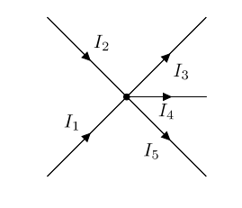

$$
I_1 + I_2 = I_3 + I_4 + I_5
$$
$$
I_1 + I_2 - I_3 - I_4 - I_5 = 0
$$

### Kirchhoff's Second Law

Around any closed loop in a circuit, the directed sum of potential differences across components is zero.

$$
\sum_{k=1}^{n} V_k = 0
$$

$$
-V_A - V_B - V_C + V_D + V_E = 0
$$

### Voltage divider

There are many types of voltage dividers, being named according to the type of component elements: resistive divider, capacitive divider, compensated divider, etc...   
The **resistive voltage divider** is obtained by applying a voltage $$E$$ to a group of resistors in series and thus a fraction of the voltage applied to one of the resistors of the group can be obtained.

$$
V_{out} = V_{in} * \frac{R_{2}}{R_{1} + R_{2}};
$$

:::warning
The voltage divider can be considered a power source only if it operates in the empty state. It is **not recommended** to use a voltage divider to supply a circuit as the internal resistance is high and energy is lost due to heating. It can be used to provide reference points.
:::
#### What happens if we use the voltage divider to supply a circuit.

We consider a voltage divider that provides $$3V3$$ from a $$5V$$ power source $$E$$ and a load resistance, $$R_s$$, representing the current consumption of a sensor or a circuit that needs to be supplied at $$3V3$$.

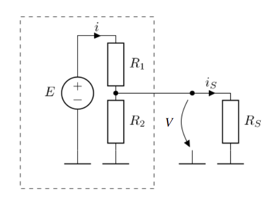

From Kirchhoff's First Law, the current through $$R_1$$ must be equal to the sum of the current through $$R_2$$ and $$R_s$$. 

$$
I_{R_1} = I_{R_2} + I_{R_S}
$$
$$
V = V_{E} * \frac{R_2 || R_S}{R_1 + R_2 || R_S};
$$

:::note
Equivalent resistor value
- series

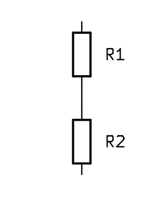

$$
R_{series} = R_1 + R_2
$$

- parallel 

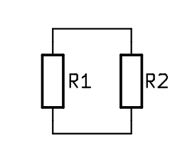

$$
R_{parallel} = R_1 || R_2
$$
$$
\frac{1}{R_{parallel}} = \frac{1}{R_1} + \frac{1}{R_2} 
$$
:::

The output voltage depends on the current intensity through $$R_s$$, on the current consumption of the circuit that needs to be supplied at $$3V3$$. This is not a viable power supply solution.

Beside the instability of the voltage divider with a load, the power rating for the $$R_1$$ must be suitable.

$$
P_{R_1} = V_{R_1} * I_{R_1}
$$

The power dissipation on the resistor is directly proportional with the current through the resistor. Resistor are fabricated with predefined power ratings, most common $$1/4W$$, $$1/2W$$, $$1W$$. 

:::note
For a better understanding, please read the chapter 10 of *Encyclopedia of Electronic Components*, Volume 1
:::

:::info
In case we want to use the voltage divider between two chosen voltage values, we can use the generalized formula:

$$
V_{out} = ( V_{1} - V_{2} ) * \frac{R_{2}}{R_{1} + R_{2}};
$$

:::

## Electronic Components  

### Actuators and sensors

In order to interface with the external environment, various electronic components are used, serving either as actuators (modifying the state of the external environment) or as transducers/sensors (influenced by the external environment and providing information to the microcontroller about various parameters).

Examples of actuators:
- Fans    
- Audible indicators (buzzers)
- Light indicators
- Heating resistors

:::tip
Sometimes, to activate an actuator, an actuating element is needed. For instance, to start a motor, the microcontroller simply sends a logical start command to a transistor that opens and allows a high current to pass through it (here, by "high current", we compare it to the maximum of a few milliamperes that a microcontroller can output).
:::

Examples of sensors:

- Buttons
- Photo resistors - their electrical resistance is influenced by the amount of light
- Thermistors - their electrical resistance is influenced by temperature

:::tip
Depending on the type of transducers, they may require signal processing before being taken in by the microcontroller (signal conditioning). For example, a photo resistor needs to be used in a circuit with a voltage divider or a current source. Alternatively, some sensors can be connected directly to the microcontroller, such as buttons.
:::

:::note
For a better understanding, please read *Encyclopedia of Electronic Components*, Volume 3
:::

### LEDs

LEDs - Light Emitting Diode - also called electroluminescent diodes - emit light when they are directly polarized. Not to be confused with light bulbs as they have radically different methods of operation.   

LEDs can be used as indicator lights (often used in various appliances to signal that the appliance is on and doing something), or for illumination, in which case power LEDs are used. In the lab, LEDs are used to indicate the status of a pin.

#### Calculation of current limiting resistor

To use an LED for the purpose of indicating the status of a pin (rather said to indicate the presence of voltage), the current through the LED must be limited. This can be done most simply by stringing a resistor with the LED.   

An LED is designed to operate at a nominal current (ex: 10mA). The voltage drop at this current across low power indicator LEDs is given by the chemistry of the LED (this also gives the color of the LED). In the lab, since we are using such a low current LED, we can power it directly from the logic pins of the MCU.

$$
R_{1} = \frac{(V_{pin} - V_{led})}{I_{led}}
$$

#### Example:

If the MCU has a pin voltage of 3.3V, also noted as 3V3, to light up an LED with a nominal current of 10mA and a voltage drop of 2V we need 
a resistance of 130 &ohm;.

:::tip
We can use a resistor with a higher resistance value. The nominal current will light up the LED at it's maximum brightness. For status LEDs we can pick a resistance even 10 times bigger and the LED will light up slightly. 
:::

:::danger
If there is no resistor in the circuit, the resistance will be almost 0 &ohm;, the current will tend to $$\infty$$, meaning a short circuit. This will absolutely burn the LED and make it unusable, but it can also burn the MCU. Most MCUs have short circuit protection, but is safer to not rely on that.  
:::

:::note
For a better understanding, please read the chapter 22 of *Encyclopedia of Electronic Components*, Volume 2
:::

### Buttons

The simplest way for the user to interact with a MCU is through the use of buttons.

There are various ways to connect a button to the MCU, but these are the most used versions:

:::warning[Incorrect]

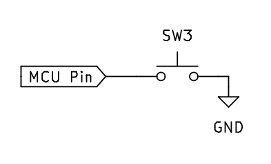   

It shows a button connected to the MCU pin. When the button is pressed, the MCU input pin will be connected to GND, so it will be in the logic "0" state. This way of binding is **incorrect** because when the button is not pressed, the input is in **an undefined state** (as if left in the air), not being connected to either GND or Vcc! This state is called the **increased impedance state**. In practice, if we now read the value of the pin, it will produce a result of 1 or 0 depending on the environmental conditions. For example, if we bring our finger closer to that input, the reading will be 1, and if we move our finger away, the reading will be 0. 
:::

:::tip[Correct]

   

 It shows the correct way to connect the button, using a **pull-up resistor** between the input pin and Vcc. This resistance has the role of bringing the input to the logic "1" state when the button is free by "raising" the line potential to Vcc. Alternatively, a **pull-down resistor** (connected to GND) can be used, in which case the input is held in the logic "0" state while the button is not pressed.
::: 

:::info
To save external space, in most MCUs these resistors have been included inside the integrated circuit. Initially they are disabled and their activation can be done through software.
:::

:::note
For a better understanding, please read the chapter 5 of *Encyclopedia of Electronic Components*, Volume 1
:::

### Breadboard and jumper wires

#### Breadboard

A breadboard is a rectangular board with a grid of holes that allows you to create temporary electronic circuits without soldering. The board typically has metal strips underneath the surface, connecting the holes in certain patterns. These patterns follow a standard layout, facilitating circuit building. Breadboards are reusable and provide a convenient way to prototype circuits quickly and make changes easily by rearranging components.

   
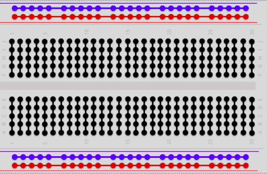   
Breadboard connection   
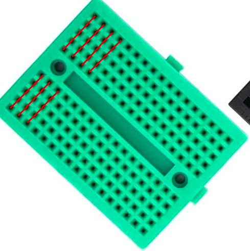   
Small breadboard connection

#### Jumper wires

Jumper wires are flexible wires with connectors at each end, typically male connectors (pins) or female connectors (sockets). They are used to create electrical connections on a breadboard by plugging one end into a hole on the breadboard and the other end into another hole, forming a connection between the two points.

   
Jumper wires

:::note
For a better understanding, please read the chapter 1 of *Encyclopedia of Electronic Components*, Volume 1
:::

## Datasheets

### What is a datasheet

Datasheets, also referred to as data sheets or spec sheets, are documents that offer a concise overview of a product, machine, component (such as an electronic part), material, subsystem (like a power supply), or software. The purpose is to provide enough information for a buyer to understand the product and for a design engineer to grasp the component's role in the overall system.

While datasheets are essential, they have limitations. Some are comprehensive, while others are brief. Certain datasheets include sample schematics as a guide for using a component, but many do not. It's important to note that datasheets typically do not go into the detailed inner workings of a component, as their primary focus is to convey essential information rather than providing in-depth explanations of functionality.

### How to read a datasheet

We will use a [presence sensor](https://ro.mouser.com/datasheet/2/365/GP2Y0A02YK0F_13May05_Spec_ED-05G127-1652666.pdf), a [voltage regulator](https://www.ti.com/lit/ds/symlink/tps74801-q1.pdf?ts=1709627122770&ref_url=https%253A%252F%252Fwww.mouser.at%252F) and a [microcontroller](https://datasheets.raspberrypi.com/rp2040/rp2040-datasheet.pdf?_gl=1*1xsgcfj*_ga*MTYzNjcwMTY1Ny4xNzA4MDAxNDU5*_ga_22FD70LWDS*MTcwOTY0NzM1Mi40LjEuMTcwOTY0NzM2MS4wLjAuMA..) datasheets for example.

#### Pin Configuration

For commonly used components, the pin configuration, or pinout, is specified directly on the board. 

   
C1202 USB to UART module

If the pinout is not present on the component, there is a sign, a dot on the case that indicates the perspective in which you need to look at the component.

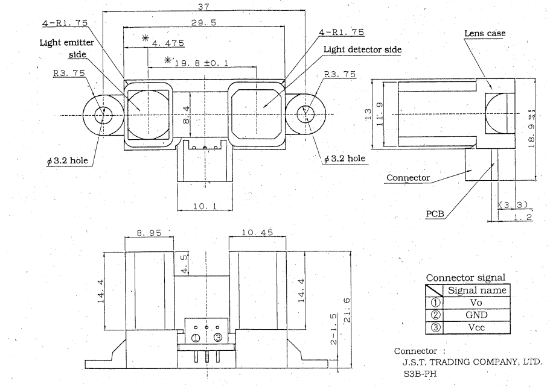   
Distance sensor - Sharp

   
Voltage regulator - Texas instruments

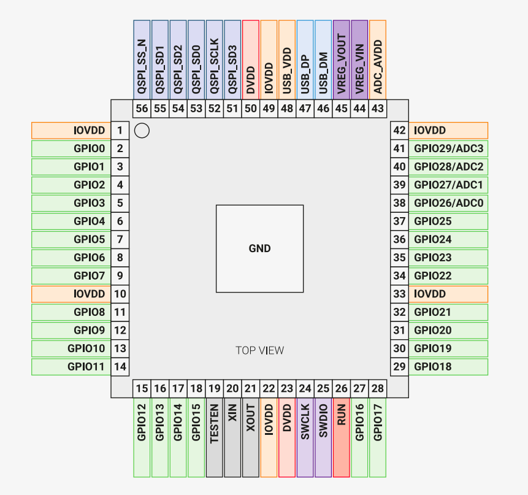   
RP2040 MCU - Raspberry Pi

The pin configuration diagrams are accompanied by pin descriptions. In this sections, the manufacturers present the functionality of every pin.

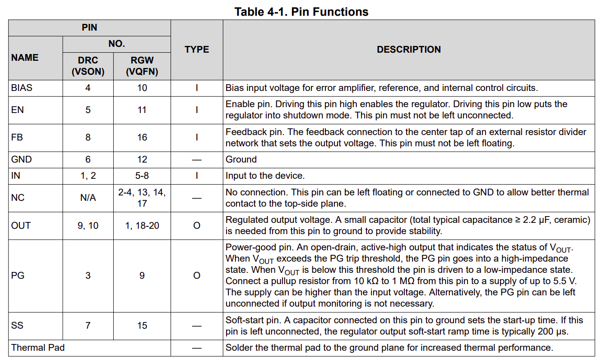   
Voltage regulator - Texas instruments

#### Operating conditions

Every electronic component has it's own characteristics and different operating conditions. The first thing tackled is the supply voltage.

   
Distance sensor - Sharp

There are two sections about the operating conditions: **absolute maximum ratings** and **recommended operating conditions**. Even if they are mentioned, you should never use your component at absolute maximum ratings as it will probably burn the component or have an undefined behavior.

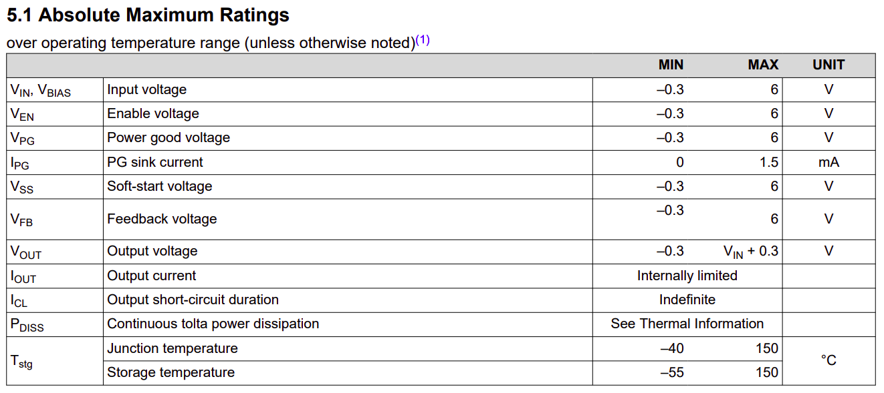
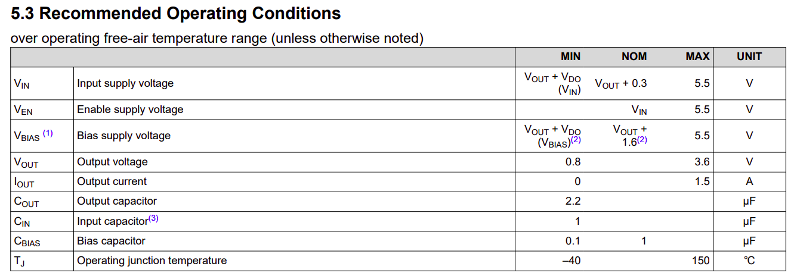
Voltage regulator - Texas Instruments

#### Output

Some components, like sensors, that are used to measure a value or to determine a condition, for simplicity, use analog output. This output is usually described in a graph.

   
Distance sensor - Sharp

## KiCad

### What is KiCad

KiCad is a free and open-source electronics design automation (EDA) suite. It features schematic capture, integrated circuit simulation, printed circuit board (PCB) layout, 3D rendering, and plotting/data export to numerous formats. KiCad also includes a high-quality component library featuring thousands of symbols, footprints, and 3D models. KiCad has minimal system requirements and runs on Linux, Windows, and macOS.

### KiCad setup

For setting up KiCad, tackle the [tutorial](../../tutorials/kicad.md).

### How to use KiCad

Create a new project `lab01` and open the schematic editor.

To add a new symbol, use the highlighted button, or use `A` shortcut.

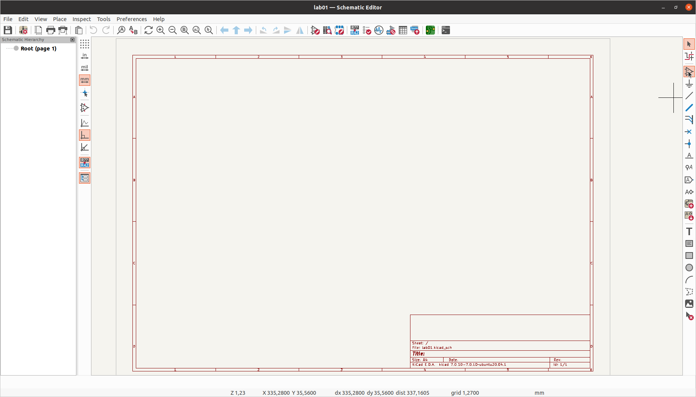   
Add symbol

In the opened dialog, search for the symbol you want to use. For this lab, we will use **Raspberry Pi Pico W** and it will be out first symbol added.

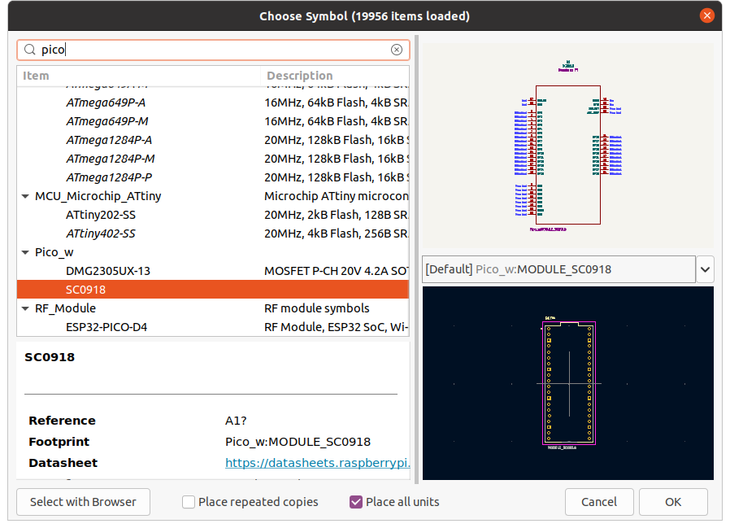   
Pick symbol

Place your symbol inside the sheet borders.

To simplify the schematic, for the most common used signals like $$V_{CC}$$(supply voltage) or $$GND$$, we use **power symbols**. Click on the highlighted button or use the `P` shortcut.

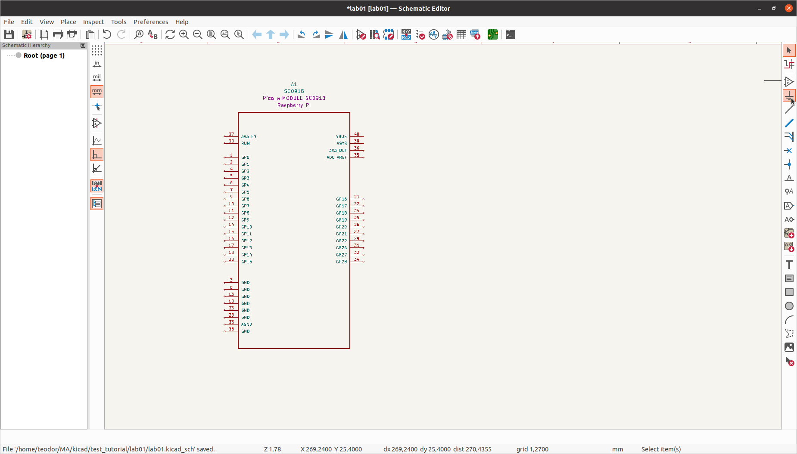   
Add power symbol

Pick $$GND$$ and place it inside the sheet borders. Connect the power signal to the $$GND$$ pins of the microcontroller. To connect, click on `Add a wire` or use the shortcut `W`.

If we take a look in the development board [datasheet](https://datasheets.raspberrypi.com/pico/pico-datasheet.pdf) at the power chain section, we can see that the power supplied of the USB connector, $$V_{BUS}$$, which is at $$5V$$ as standard, is regulated by a voltage regulator at $$3V3$$. Place a power symbol for $$V_{BUS}$$, $$3V3$$ and a $$5V$$ power symbol for $$V_{SYS}$$.

:::warning
Even if $$V_{SYS}$$ and $$V_{BUS}$$ have the same value, between them there is a protection diode for reverse current that protects both the microcontroller and the USB port of your PC. Be careful to not connect this 2 pins as it will cancel the protection diode.
:::

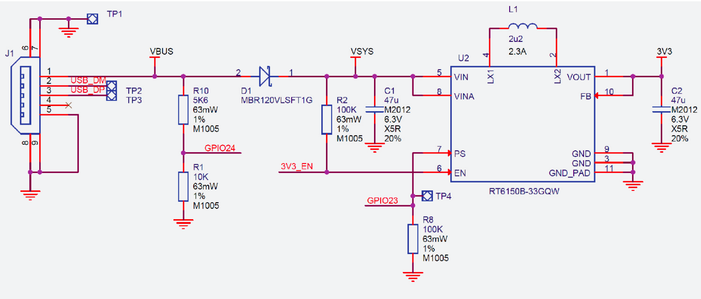   
Power Chain Raspberry Pi Pico

Complete the schematic by placing an LED and a resistor at any given GPIO pin.

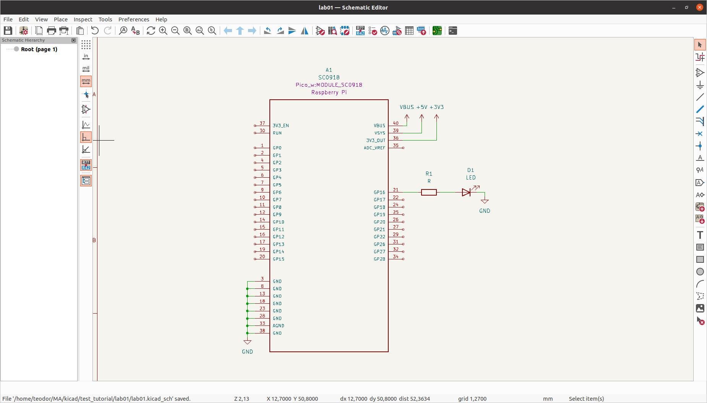   
LED Schematic

Save the file and open the PCB editor. You can use the button on the top bar of the Symbol editor.

Use the highlighted button to update the PCB with the changes made in Schematic editor.

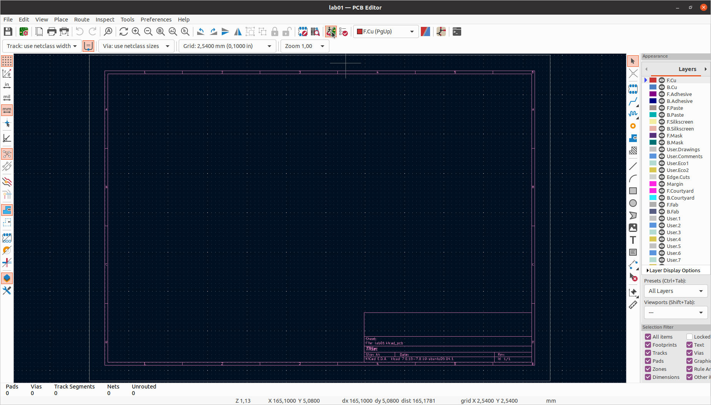   
Update PCB

You will get an error because for the resistor $$R1$$ and LED $$D1$$ there are no footprints assigned. 

   
Footprint error 

Go back to the Schematic and assign footprints for resistor $$R1$$ and LED $$D1$$ like in the setup [tutorial](../../tutorials/kicad.md). You can pick any footprint, or just paste these on footprint field in symbol properties.
- resistor: Resistor_THT:R_Axial_DIN0204_L3.6mm_D1.6mm_P2.54mm_Vertical
- LED: LED_THT:LED_D3.0mm

Go back to the PCB editor and try to update again.

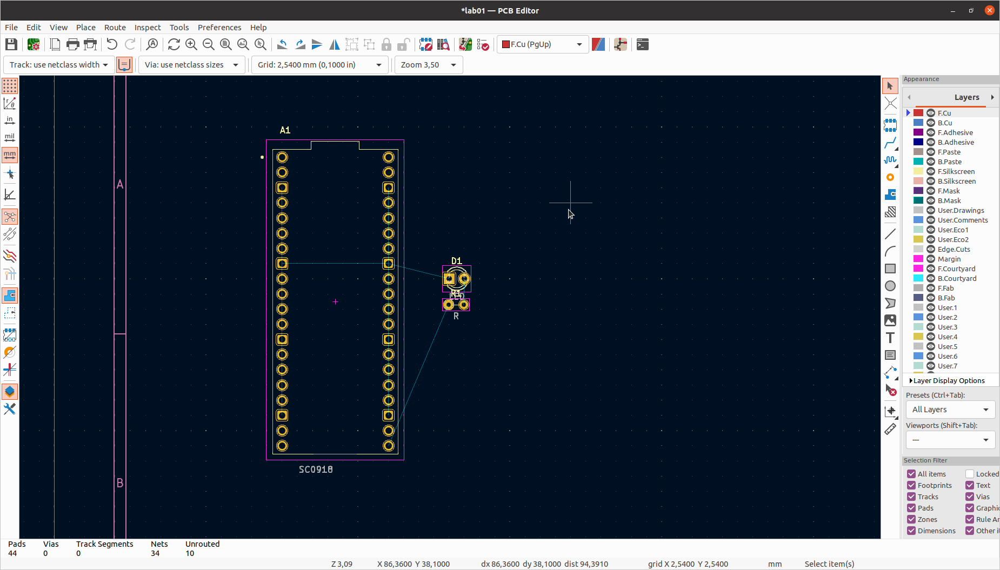   
Update PCB

Connect the components using the `Route tracks` button on the right or the shortcut `X`. The blue lines will guide you to connect the right pins.

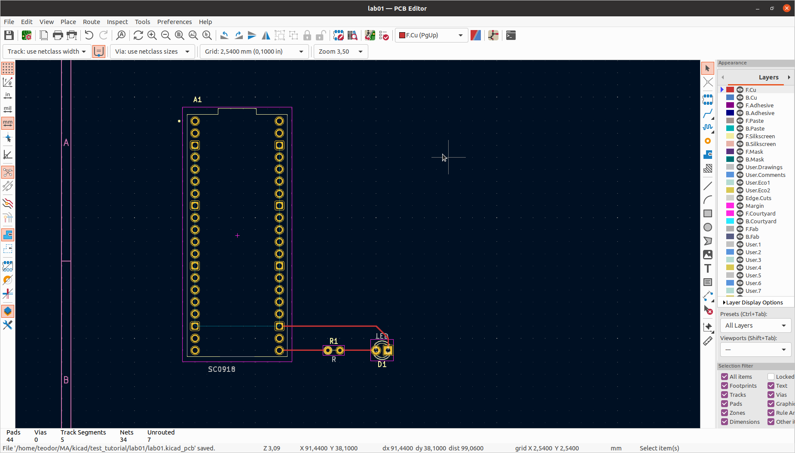   
Route tracks

KiCad offers a 3D Viewer to have a preview of how the PCB will look. Click on `View` -> `3D Viewer`

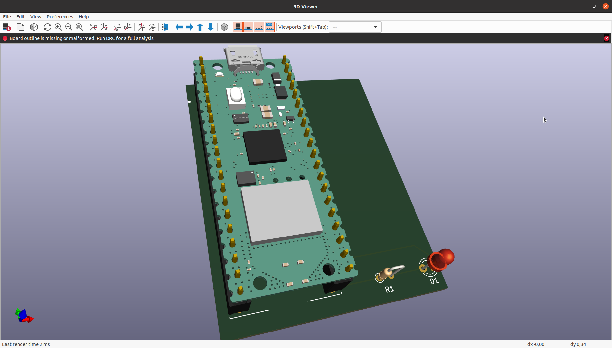   
3D View

:::note
For a better understanding, please read [Getting Started in KiCad](https://docs.kicad.org/7.0/en/getting_started_in_kicad/getting_started_in_kicad.html) tutorial.
:::

## Exercises

1. Complete the given exercise sheet.(**3p**)

2. The microcontroller will be running these precompiled programs for [Pico W](../../../assets/lab01/firmware/pico_w.uf2) and [Pico H](../../../assets/lab01/firmware/pico_h.uf2). Assemble a circuit surrounding the microcontroller in order to perform the next tasks:(**3p**)
:::info
To flash the board, you will need to connect the boards to your PC while holding down the `BOOTSEL` button. This should *"mount"* it as a an external drive. The next step is to copy and paste the `.uf2` files in the `RPI-RP2` drive.
:::
- Connect a status LED that is ON as long as the microcontroller has power supplied. The pin that determines the status of the microcontroller is GP1.
:::warning
Make sure you connect a resistor in series wit the LED.
:::
- A button is used to toggle the integrated LED of the development board. Connect the button to the GP2 pin. 
:::note
Make sure you use a pull-up resistor.
:::
- The screen displays an analog value read by the microcontroller on pin ADC0. Create a circuit and connect it to ADC0 so that the display shows the value $$1.65V$$.
:::tip
Use a voltage divider.
:::

:::danger
Do not supply power to the microcontroller before the lab teacher checks the circuit.
:::

3. Design the circuit in KiCad.(**3p**) 

[^si]: The International System of Units, the world's most widely used system of measurement.
