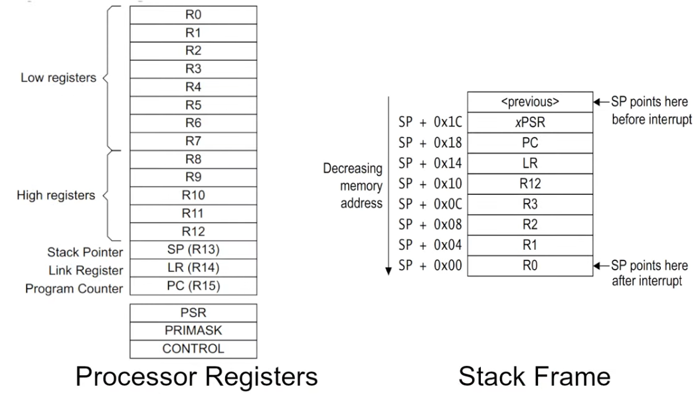
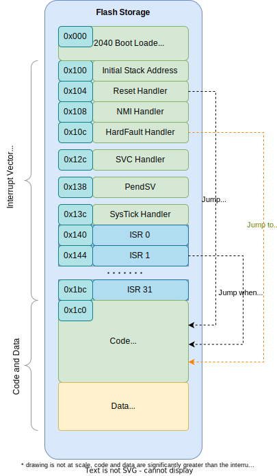
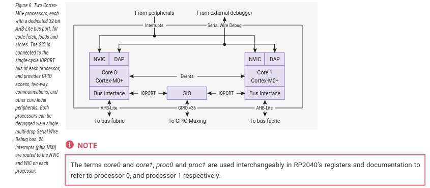

# 03 - Exceptions & Interrupts

The purpose of this lab is to understand how exceptions and hardware interrupts work and how they can be used, how to set a hard fault handler,
register interrupts and *use interrupts*  with embassy-rs.


## Resources

1. **Raspberry Pi Ltd**, *[RP2040 Datasheet](https://datasheets.raspberrypi.com/rp2040/rp2040-datasheet.pdf)*
2. [Cortex-M0+ Devices Generic User Guide](https://developer.arm.com/documentation/dui0662/latest/)
3. [Embassy documentation](https://embassy.dev/book/dev/runtime.html)


## What is an exception? 

Exceptions describe any condition that requires the processor to stop what it is doing
and do something else. Section 2.3.2 of [Cortex-M0+ Devices generic User Guide](https://documentation-service.arm.com/static/5f04abc8dbdee951c1cdc9f7?token=) lists 7 types of exceptions:


| Exception | Priority | Descriptions |
|-----------|----------|--------------|
| Reset | -15 | Triggered by the system at startup to start the software |
| NMI | -14 | Non Maskable Interrupts, an external interrupt that cannot be ignored, usually used for low latency peripheral needs the attention of the MCU |
| HardFault | -13 | Triggered by the MCU in case of a fault (div by 0, memory fault, ...) |
| SVC | -5 | Supervisor call, triggered usually by a process running on top of the embedded operating system when it wants to make a system call |
| PendSV | -2 | Used for pending system calls |
| SysTick | -1 | Triggered by a periodic timer, usually used by an embedded operating system for context switch |
| Interrupt (IRQ) | 0 and above| Triggered by a peripheral, or generated by a software request

## What is an interrupt?

A hardware interrupt is an type of exception which is a synchronous or asynchronous signal from a peripheral that signals the occurrence of an event that must be handled by the processor. Interrupt handling has the effect of suspending a program's normal thread of execution and launching an interrupt service routine (ISR).

Generally, to associate an interrupt with a specific routine in the program, the processor uses the interrupt vector table (IVT). In this table, each interrupt is associated with the address to which the program will jump when the interrupt is triggered. These addresses are predefined and are mapped in program memory.


The image above illustrates the whole  vector table of ARM Cortex-M0.
It includes exceptions mapped from address 0x04 to 0x40+4n (n depends on the processor type). Lower address means higher priority.
Higher priority exceptions can interrupt lower priority exceptions.

## Exception and Interrupt Handling

When an interrupt request happens the first thing that the processor does is to memorize its current state. For ARM Cortex-M0 this happens by pushing 8 words or registered data into the main stack to provide the information
need to return the processor to what it was doing before before the interrupt request was called. This part is called the stack frame and it includes registers 0 through 3, register 12, the link register, the program counter and the program status register.




ARM Cortex-M microcontrollers also use a Nested Vectored Interrupt Controller (NVIC).The NVIC is specifically designed to handle these interrupts more efficiently. Interrupt addresses in the NVIC memory region are set according to their priority: the lower the address, the higher the priority. As suggested by the "Nested" in its name, the NVIC supports nested interrupts. This means that if a higher priority interrupt occurs while another interrupt is being processed, the controller can pause the current interrupt service routine (ISR), handle the higher priority interrupt, and then resume the interrupted ISR. This feature is crucial for responsive and real-time processing.

Exception handlers are registerd using the `exception` macro provided by the `cortex-m-rt` crate.

```rust
#[exception]
unsafe fn ExceptionName() {

}
```

:::info

The name of the exception handler function matters, as this is the way the `exception` macro knows for which exception to
register the handler. Valid exception names are `HardFault`, `SysTick`, or any other exception name of the MCU.

:::

## RP2040

The RP2040 is an ARM Cortex-M0+ dual core processor. It does have some particularities.

### Boot

The RP2040 boots from an internal bootloader that sets the initial interrupt IVT.

```mermaid
flowchart LR
    S(PowerUp) --> I
    subgraph I0[Internal Boot Loader]
        I{BOOTSEL
        Pressed} -- Yes --> U
        I -- NO --> R(Read 
        Boot Loader 
        @x1000_0000)
        R -- Error --> U(Show USB 
        Drive)
    end
    R -- Success --> E2(Load
    Interrupt
    Vector)
    E2 -- Fault --> E3(Jump to 
    HardFault 
    Handler)
    E3 -- Fault --> L(Lockup
    or
    Reset)
    E2 --> S2(Set Stack 
    Pointer)
    S2 --> E(Jump to 
    Reset 
    Exception 
    Handler)
    E -- Invalid --> E3
    E --> F(Fetch 
    Instruction)

    classDef memory fill:#B0E3E6,stroke:#0E8088
    classDef instruction fill:#B1DDF0,stroke:#10739E
    classDef processor fill:#FFE6CC,stroke:#D79B00
    classDef exception fill:#F8CECC,stroke:#B85450
    classDef error fill:#ff0000,stroke:#ae0000,color:#ffffff
    classDef start fill:#00ef00
    classDef rom fill:#f7ffe7

    class A,E,E2,S2 instruction
    class R,F memory
    class B,V,R2,I,I2,I3,H,U processor
    class L error
    class E3 exception
    class S start
    class I0 rom
```

The before starting the actual code written into Flash, the internal bootloader loads a secondary bootloader that
is written in Flash (the first 256 bytes) together with the developer's app. 
This is the bootloader section that was described in [lab 02](/docs/lab/02#bootloader).

The IVT that the Flash application provides start after the secondary bootloader, at address 0x100.

<div align="center">
    
</div>

### Interrupts

The RP2040 chip has two cores (processors), and each core has its own NVIC. Each core's NVIC is connected to the same set of hardware interrupt lines with one exception: IO Interrupts. In the RP2040, IO interrupts are organized by banks, and each core has its own set of IO interrupts for each bank. The IO interrupts for each core are completely independent. For instance, Processor 0 (Core 0) can be interrupted by an event on GPIO pin 0 in bank 0, while Processor 1 (Core 1) can be interrupted by a separate event on GPIO pin 1 in the same bank. Each processor responds only to its own interrupts, allowing them to operate independently or to handle different tasks simultaneously without interfering with each other.



#### Available interrupt request signals (IRQ)

On RP2040, only the lower 26 IRQ signals are connected on the NVIC, as seen in the table below, and IRQs 26 to 31 are tied to zero (never firing).
The core can still be forced to enter the relevant interrupt handler by writing bits 26 to 31 in the NVIC ISPR register.


The priority order is determined for these signals is determined by :

- First, the dynamic priority level configured per interrupt by the `NVIC_IPR0-7` registers. The Cortex-M0+ implements
the two most significant bits of an 8-bit priority field, so four priority levels are available, and the numerically-lowest
level (level 0) is the highest priority.
 - Second, for interrupts with the same dynamic priority level, the lower-numbered IRQ has higher priority (using the
IRQ numbers given in the table above)


#### GPIO Interrupts

All GPIO pins in Raspberry Pi Pico support interrupts. The interrupts can be classified into three types:

- *Level High*: An interrupt occurs while a pin is HIGH or at logic 1.
- *Level Low*: An interrupt occurs while a pin is LOW or at logic 0.
- *Rising Edge*: Interrupt occurs when a pin transitions from a LOW to HIGH.
- *Falling Edge*: Interrupt occurs when a pin transitions from HIGH to LOW.


## Handling a HardFault

There are several reasons why a hard fault is triggered:
- **invalid memory** reads and writes
- *invalid* address of the *reset handler* (not the case for RP2040, as the real reset handler is in the Bootrom)
- *invalid* address of the *initial stack pointer* (not the case for RP2040, as the real reset handler is in the Bootrom)
- using the *svc* instruction *in the HardFault handler*
- using the *svc* instruction *NMI handler*

### Register a HardFault handler

The `cortex-m-rt` crate allows an easy way of registering a hard fault handler by using
the `exception` macro.

```rust
#[exception]
unsafe fn HardFault(_frame: &ExceptionFrame) -> ! {
    loop{}
}
```

The `ExceptionFrame` parameter contains the state of the processor at the moment of the hard fault occured.
It contains the stack frame (registers) that the processor pushed on the stack.

:::warning

The hard fault handler is now allowed to return, as usually, unless an embedded operating system is used, this error is not recoverable. 

:::

### Triggering a hard fault

The easiest way of forcing a hard fault is to try to read or write to or from a memory location that is not valid.
For the RP2040, an invalid memory address is `0xf000_0000`.

```rust
// define an invalid memory address
const INVALID_ADDRESS: *const u32 = 0xf000_0000 as *const u32;

// write to it
unsafe {
    // this triggers a hard fault
    write_volatile(INVALID_ADDRESS, 0);
}
```

## Handle Interrupts using `embedded-hal`

Setting up an interrupt is a bit more complicated than handling 
a simple exception because we also need to enable that interrupt and bind it to the signal coming from a peripheral.
Additionally, we need to manually clear the interrupt (signal that we handled the interrupt) in the 
interrupt handler, otherwise as soon as the interrupt handler finishes, it gets called again. 

```rust
// Add the interrupt macro
use hal::pac::interrupt;
use rp2040_hal::gpio;

// The GPIO interrupt type we're going to generate
use rp2040_hal::gpio::Interrupt::EdgeLow;
```
### Setup the peripherals 

If peripherals will be used in the interrupt handler function we need to set up a mutex to safely access them.

```rust
/// This pin will be our interrupt source.
/// It will trigger an interrupt if pulled to ground (via a switch or jumper wire)
type ButtonPin = gpio::Pin<gpio::bank0::Gpio0, gpio::FunctionSioInput, gpio::PullUp>;

type Button = (ButtonPin);

/// This how we transfer our Button pins into the Interrupt Handler.
/// We'll have the option hold the Button using the Button type.
/// This will make it a bit easier to unpack them later.
static GLOBAL_PINS: Mutex<RefCell<Option<Button>>> = Mutex::new(RefCell::new(None));

```

### Enable interrupt 


```rust 

// Set up the GPIO pin that will be our input
let in_pin = pins.gpio0.reconfigure();

// Trigger on the 'falling edge' of the input pin.
// This will happen as the button is being pressed
in_pin.set_interrupt_enabled(EdgeLow, true);

```

### Give back the pins

```rust
// Give away our pins by moving them into the `GLOBAL_PINS` variable.
critical_section::with(|cs| {
    GLOBAL_PINS.borrow(cs).replace(Some((led, in_pin)));
});

```
### Unmask the IO_BANK0 IRQ

so that the NVIC interrupt controller
will jump to the interrupt function when the interrupt occurs.

```rust
 unsafe {
        pac::NVIC::unmask(pac::Interrupt::IO_IRQ_BANK0);
        }
```


### Define the interrupt handler

When defining an interrupt handler we need to:

- Add `#[interrupt]` attribute which requires the cortex-m-rt crate for defining interrupt handlers.
- Add code for that should run after button is pressed
- Take the gpio's resources that we defined, clear interrupt flag so that it doesn't enter `IO_IRQ_BANK0()` again without a button press.

```rust
#[interrupt]
fn IO_IRQ_BANK0() {

    // Do something
    //Example: toggle LED

    static mut BUTTON: Option<Button> = None;

    critical_section::with(|cs| {
        *BUTTON = GLOBAL_PINS.borrow(cs).take();
    });
    
    // Need to check if our Option<ButtonPins> contains our pins
    if let Some(button) = BUTTON {

        // Clear the interrupt so that it doesn't enter the ISR again
        button.clear_interrupt(EdgeLow);

        //give away the borrowed button
        critical_section::with(|cs| {
        GLOBAL_PINS.borrow(cs).replace(Some((button)));
    });

    }

    
}
```

:::note

To use pins from main into the interrupt handler we will need to setup mutexes as well.

:::

## Handle Interrupts using `embassy-rs`


In Embassy, handling interrupts does not involve manually setting up interrupt service routines (ISRs) in the traditional sense that you might be used to with bare-metal or lower-level embedded programming. Instead, Embassy abstracts away the hardware-specific details and provides a higher-level async API for working with hardware events, including interrupts.

Embassy uses Rust's `async`/`await` syntax to provide an easier way to write non-blocking embedded applications. This approach allows you to wait for events (like GPIO pin changes, which could be triggered by hardware interrupts underneath). In a way that looks synchronous but is actually non-blocking and handled asynchronously by the Embassy executor.

:::note

Async and await mechanisms will be discuses in more detail in course_04 and lab_05. 

:::


:::note

Unlike the usb drive, GPIO pins don't need explicit interrupt binding.
All interrupts handlers are already associated to the type of the input signal (rising edge, level low etc.)

:::

For example, if you're waiting for a button press, you don't need to set up the interrupt yourself; you simply use Embassy's GPIO API to wait for the pin change event 
```rust
button.wait_for_rising_edge().await
```

If we want the main loop to keep running regardless of the button state, we need to define a new task. A task in Embassy is an `async` function that will run in parallel with other tasks. It can pause its execution at certain points, waiting for some conditions to be met (like waiting for an I/O operation to complete, a timer to elapse, or an external event to occur), and then resume where it left off.  


### Define the task function
```rust
#[embassy_executor::task]
async fn my_task() {
    // initialize gpio
    loop {
        
        //Wait for button button to be pressed
        button.wait_for_rising_edge().await;
        //Do something only if button was pressed
        //(Here should be the logic for your interrupt request handler)
        //Example: turn on the LED
        
    }
}
```

### Pass the your function to the task spawner
```rust
use embassy_executor::Spawner;

#[embassy_executor::main]
async fn main(spawner: Spawner) {

    //  Spawn my_task
    spawner.spawn(my_task()).unwrap();

    loop {
        //Do something
        //...
    }
}
```

### Passing states between tasks

Sharing data safely between tasks can be done using shared resources that ensure access is synchronized to prevent race conditions and other concurrency issues. Rust's `core::sync::atomic` provides types such as `AtomicBool`, `AtomicIsize`, `AtomicUsize` that can make read and write operations to be executed atomically. This means that read and write operations cannot be interrupted by interrupts or other tasks. 

```rust
use core::sync::atomic::{AtomicU32, Ordering};

static SHARED_VAL: AtomicU32 = AtomicU32::new(0 /*initial value*/);

//read value in task
let val = SHARED_VAL.load(Ordering::Relaxed);

//write value in task
SHARED_VAL.store(val, Ordering::Relaxed);
```

:::note

For scenarios where atomic operations are not sufficient and you need to protect more complex interactions or data structures, using a Mutex from Embassy is more appropriate. Embassy's Mutex is designed to be used in asynchronous environments, allowing tasks to await the lock without blocking.

:::


## Inspect binaries
When working in Rust, `rust-objdump` can be used to inspect the compiled output to see sections and interleaved code. This is particularly useful to inspect code and debug.

### Install cargo binutils
Before you can use `rust-objdump` with Rust projects, you'll need to install `cargo-binutils`.


```bash
cargo install cargo-binutils
rustup component add llvm-tools-preview
```

### Check section headers

```shell
rust-objdump --section-headers target/thumbv6m-none-eabi/debug/<executable_name>
```

```shell

Sections:
Idx Name            Size     VMA      Type
  0                 00000000 00000000 
  1 .vector_table   000000c0 10000100 DATA
  2 .boot_loader    00000100 10000000 DATA
  3 .text           00000b10 100001c0 TEXT
  4 .rodata         000001a4 10000cd0 DATA
  5 .data           00000000 20000000 DATA
  6 .gnu.sgstubs    00000000 10000e80 TEXT
  7 .bss            00000000 20000000 BSS
  8 .uninit         00000000 20000000 BSS
  9 .debug_abbrev   00001bce 00000000 DEBUG
 10 .debug_info     00025316 00000000 DEBUG
 11 .debug_aranges  000014b8 00000000 DEBUG
 12 .debug_str      0003c860 00000000 DEBUG
 13 .debug_pubnames 000175c6 00000000 DEBUG
 14 .debug_pubtypes 00000ee6 00000000 DEBUG
 15 .comment        00000073 00000000 
 16 .ARM.attributes 00000032 00000000 
 17 .debug_frame    00004444 00000000 DEBUG
 18 .debug_line     00023790 00000000 DEBUG
 19 .debug_ranges   00016df8 00000000 DEBUG
 20 .debug_loc      00000074 00000000 DEBUG
 21 .symtab         00000970 00000000 
 22 .shstrtab       00000103 00000000 
 23 .strtab         00000fe4 00000000 
```

### Disassemble a specific section

```bash
rust-objdump --disassemble -j .section_name target/thumbv6m-none-eabi/debug/<executable_name>
```

:::info

`cargo objdumb` and `rust-objdump` tools use llvm's `objdump` tool.
Some terminals do not parse parameters proxied to `llvm-objdump` command.
If this happens please use `llvm-objdump` script directly like so

```shell
llvm-objdump <path_to_binary> --section.headers
```

:::

## Exercises


1. Connect an LED1 to pin 0 and an LED2 to pin 1. Use [KiCad](https://www.kicad.org/) to draw the schematics.
2. Write a program using `embedded-hal` that blinks the LED2. Use `rust-objdump` to display the sections.

:::tip

Use the code from [Lab 02](/docs/lab/02).

:::

You should be able to see the:
- bootloader section
- interrupt vector
- the code part (.text segment)

3. Register a hard fault handler that blinks LED2.
   1. Generate a hard fault, you should see LED1 stop blinking (either on or off) and the LED2 blink
   2. Move the blinking LED2 code to the panic handler and make sure it is called when a hard fault is generated.
4. Register an interrupt on the pin connected to button A. Toggle an LED each time the button is pressed.
5. Use `embassy-rs` to obtain the same result.

:::tip

Spawning a new task might be a good idea.

:::
