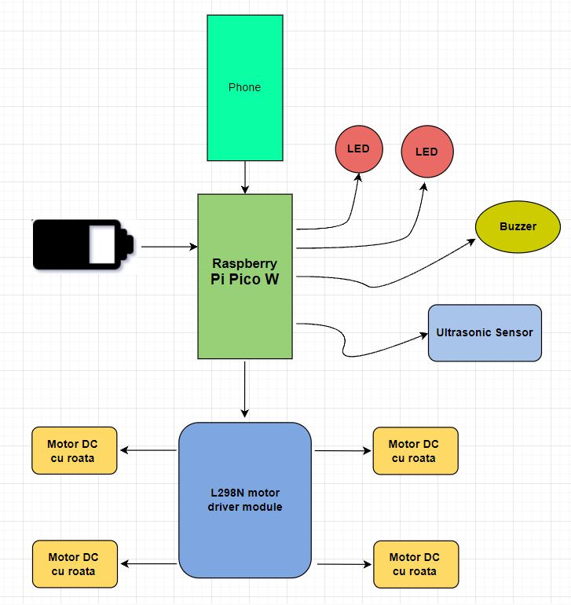

# Electronic Car 

Remote-controlled car built and operated via smartphone.

:::tip
**Author**: Bontas Adrian-Cosmin \
**GitHub Project Link**: https://github.com/UPB-FILS-MA/project-adriancosm1n
:::

## Description

Picture this: a car you can drive using your phone. That's exactly what I'm making! It's a cool little car you can control with an app on your personal phone. You can make it go forward or backwards, left or right, only by tapping on your screen. It is super fun to play with and it's an interesting way to learn about how things work in electronic applications!

## Motivation

I picked this project simply because I love cars. They're exciting and fun, and I can't get enough of them! Building a remote-controlled car that I can control with my phone lets me combine my passion for cars with learning about technology. It's like bringing two awesome things together into one cool project. Plus, working on something I'm so passionate about makes the whole experience even more enjoyable. So, that's why I decided to go for it!

## Architecture 

This project diagram illustrates the connectivity of the system utilizing a Raspberry Pi Pico W as the main controller. The Raspberry Pi Pico W is connected to various components including two LEDs which act as headlights, a buzzer acting as a horn, an ultrasonic sensor, and four DC motors with wheels through an L298N motor driver module. 

## Log

### Week 6 - 12 May

### Week 7 - 19 May

### Week 20 - 26 May

## Hardware

1x Raspberry Pi Pico W: acts as the primary processing unit, equipped with Wi-Fi capabilities.

1x HC-SR04 Ultrasonic Sensor: utilized for measuring distances to detect nearby objects.

1x L298N Motor Driver Module: Provides the ability to control the four wheels.

4x Wheels with motors 

2x LEDs

1x Buzzer

1x Power Supply 

### Schematics

Place your KiCAD schematics here.

### Bill of Materials

| Device | Usage | Price |
|--------|--------|-------|
| [Rapspberry Pi Pico W](https://www.raspberrypi.com/documentation/microcontrollers/raspberry-pi-pico.html) | The microcontroller | [35 RON](https://www.optimusdigital.ro/en/raspberry-pi-boards/12394-raspberry-pi-pico-w.html) |
| [HC-SR04 Ultrasonic Sensor](https://cdn.sparkfun.com/datasheets/Sensors/Proximity/HCSR04.pdf) | The ultrasonic sensor | [9.72 RON](https://ardushop.ro/ro/electronica/47-modul-senzor-ultrasonic-detector-distanta.html?gad_source=1&gclid=Cj0KCQjwudexBhDKARIsAI-GWYUu-UY1IrO9avytw3Yu07_lr7Z0ibjTY1eSM-3cM0lNivtstNKAoE0aAiA-EALw_wcB) |
| [L298N Motor Driver Module](https://www.handsontec.com/dataspecs/L298N%20Motor%20Driver.pdf) | The motor driver module | [14.11 RON](https://www.emag.ro/driver-de-motor-l298-robofun-red-board-2-canale-00003257/pd/D3L6FYYBM/?cmpid=93116&utm_source=google&utm_medium=cpc&utm_campaign=(RO:eMAG!)_3P_NO_SALES_%3e_Jucarii_hobby&utm_content=111476631565&gad_source=1&gclid=Cj0KCQjwudexBhDKARIsAI-GWYUdVnmVS6SXbXK6EvgRCm6S-AAUBhii2pH_ITyzJ63sTfea7Bj7hT4aAk0qEALw_wcB) |
| [LED](https://www.farnell.com/datasheets/1498852.pdf) | The LEDs | [0.45 RON x 2](https://ardushop.ro/ro/electronica/299-led-5mm.html?search_query=Led&results=242#/10-culoare-rou) |
| [Buzzer](https://www.farnell.com/datasheets/2171929.pdf) | The Buzzer | [3.97 RON](https://ardushop.ro/ro/electronica/194-buzzer.html?search_query=passive+buzzer&results=18) |
| [Male to male jumper wires](https://www.optimusdigital.ro/ro/fire-fire-mufate/888-set-fire-tata-tata-40p-20-cm.html?search_query=fire+tata+tata&results=80) | The Wires | [6.98 RON](https://www.optimusdigital.ro/ro/fire-fire-mufate/888-set-fire-tata-tata-40p-20-cm.html?search_query=fire+tata+tata&results=80) |
| [Female to female jumper wires](https://www.optimusdigital.ro/ro/fire-fire-mufate/880-fire-colorate-mama-mama-10p-10-cm.html?search_query=fire+mama+mama&results=63) | The Wires | [6.98 RON](https://www.optimusdigital.ro/ro/fire-fire-mufate/880-fire-colorate-mama-mama-10p-10-cm.html?search_query=fire+mama+mama&results=63) |
| [Power Supply](https://www.farnell.com/datasheets/1842389.pdf) | The Power Supply | [14.90 RON](https://www.f64.ro/duracell-baterie-9v-1-buc/p?gad_source=1&gclid=Cj0KCQjwudexBhDKARIsAI-GWYXymIXBAeaveT-qoPVnhzXQIKkjNwq0sgL0yQ5AoXXIh_sc-7csLOQaAjr9EALw_wcB) |
| [Wheels with motors](https://www.bitmi.ro/set-motor-dc-3v-6v-cu-reductor-si-roata-11227.html?2pau=a7c80ffd2&2ptt=quicklink&2ptu=989f060e9&2pdlst=Cj0KCQjwudexBhDKARIsAI-GWYXmymOCVySPbqVyF6R0s9eNqnQNxxivZnSe-VKmTbVn7LHFsRvpjr4aAoEZEALw_wcB&gad_source=1&2pau=a7c80ffd2&2ptt=quicklink&2ptu=989f060e9&2prp=8BAwO04dPx17FdUGVKRQ-_VE7fv-poFhx7OPkUhESDVdX0kJlCOs-0BCWVmoXnyVSebtiBXcYbPKxn3JczKtNzCyIZ8rVY--HGmrp6jBgAClJeoL11Oa5NSpJ19VnW2hCIOg4_QfGCEfTxtz_mEaOKSF4ugOnatpglB5aVsIjcOjZ8X8Aw49sYjrABloOWJYO5F14dubQ-_uxD1MffLaotxIpZmbXGowqxl0Prn-7_4&2pdlst=) | The wheels and motors | [8.99 RON x 4](https://www.bitmi.ro/set-motor-dc-3v-6v-cu-reductor-si-roata-11227.html?2pau=a7c80ffd2&2ptt=quicklink&2ptu=989f060e9&2pdlst=Cj0KCQjwudexBhDKARIsAI-GWYXmymOCVySPbqVyF6R0s9eNqnQNxxivZnSe-VKmTbVn7LHFsRvpjr4aAoEZEALw_wcB&gad_source=1&2pau=a7c80ffd2&2ptt=quicklink&2ptu=989f060e9&2prp=8BAwO04dPx17FdUGVKRQ-_VE7fv-poFhx7OPkUhESDVdX0kJlCOs-0BCWVmoXnyVSebtiBXcYbPKxn3JczKtNzCyIZ8rVY--HGmrp6jBgAClJeoL11Oa5NSpJ19VnW2hCIOg4_QfGCEfTxtz_mEaOKSF4ugOnatpglB5aVsIjcOjZ8X8Aw49sYjrABloOWJYO5F14dubQ-_uxD1MffLaotxIpZmbXGowqxl0Prn-7_4&2pdlst=) |

## Software

| Library | Description | Usage |
|---------|-------------|-------|
| [embassy](https://github.com/embassy-rs/embassy) | Embassy | An asynchronous executor and Hardware Abstraction Layer (HAL) designed for constructing embedded applications in Rust. |
| [embassy-network](https://github.com/embassy-rs/embassy-network) | Embassy Network | A networking library designed for use with the Embassy asynchronous executor, facilitating network communication within embedded Rust applications. |
| [PWM](https://docs.embassy.dev/embassy-nrf/git/nrf52840/pwm/index.html)|Pulse-width modulation |Used for controlling the buzzer's sound intensity |
| [HC-SR04](https://github.com/Benehiko/pico-ultrasonic-rs.git) |HC-SR04 manipulation| Used for controlling the ultrasonic sensor|

## Links

1. [Freenove 4WD Car Kit for Raspberry Pi Pico](https://www.youtube.com/watch?v=JimfJCyrK44)
2. [Raspberry Pi Pico - Bluetooth Controlled Car Project](https://www.youtube.com/watch?v=U4unGGNjFBg)
3. [NerdCave](https://nerdcave.xyz/)
...
