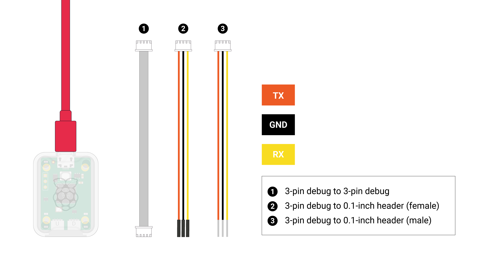
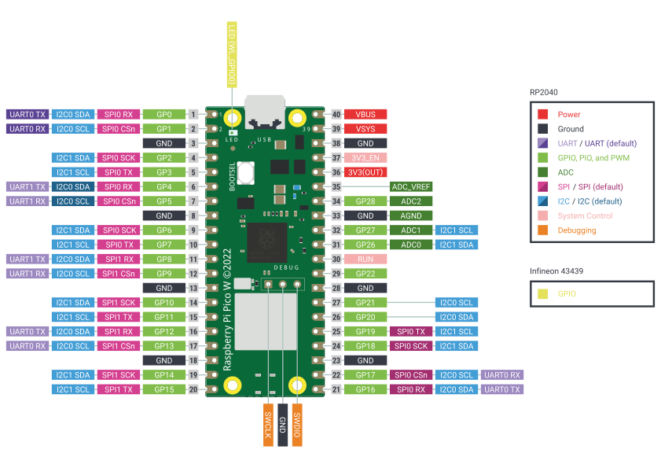

# Embassy-rs Setup

Here, we will cover the steps needed in order to be able to compile and flash Rust applications for **RP2040**, the MCU (Microcontroller Unit) found in our **Raspberry Pi Pico W**s.

## Prerequisites

### Rust Toolchain

In order to install the tools needed to compile Rust code, follow the next steps, depending on your operating system.

#### Linux

Run the this command in terminal:

```shell
curl --proto '=https' --tlsv1.2 -sSf https://sh.rustup.rs | sh
```

This downloads and runs `rustup-init.sh`, which in turn downloads and runs the correct version of the `rustup-init` executable for your platform.

#### Windows

Download the respective executable:

* [RUSTUP-INIT.exe - 64bit](https://static.rust-lang.org/rustup/dist/x86_64-pc-windows-msvc/rustup-init.exe)
* [RUSTUP-INIT.exe - 32bit](https://static.rust-lang.org/rustup/dist/i686-pc-windows-msvc/rustup-init.exe)

:::note
You may be prompted to install [Visual Studio C++ Build tools](https://visualstudio.microsoft.com/visual-cpp-build-tools/). If so, follow the instructions from the previous link.
:::

The last step is to run `rustup --version` in terminal. If everything went well, you should see an output similar to this:

```shell
rustup 1.26.0 (5af9b9484 2023-04-05)
info: This is the version for the rustup toolchain manager, not the rustc compiler.
info: The currently active `rustc` version is `rustc 1.76.0 (07dca489a 2024-02-04)`
```

### `elf2uf2-rs`

This tool is needed to be able to program the board over USB. In order to install it, run the following in your terminal:

```shell
cargo install elf2uf2-rs
```

Then, run `elf2uf2-rs --help`. If it was correctly installed, you should see something similar to this in your terminal:

```shell
Usage: elf2uf2-rs [OPTIONS] <INPUT> [OUTPUT]

Arguments:
  <INPUT>   Input file
  [OUTPUT]  Output file

Options:
  -v, --verbose  Verbose
  -d, --deploy   Deploy to any connected pico
  -s, --serial   Connect to serial after deploy
  -h, --help     Print help
```

### `probe-rs`

This tool is an embedded debugging and target interaction toolkit. It enables its user to program and debug microcontrollers via a debug probe.

```shell
cargo install probe-rs --features cli --locked
```

If you are on **Linux** you will also need to add this [`udev`](https://probe.rs/files/69-probe-rs.rules) file in `/etc/udev/rules.d`. Then, run:

```shell
udevadm control --reload # to ensure the new rules are used.

udevadm trigger # to ensure the new rules are applied to already added devices.
```

### VSCode Extension (Optional)

For a better experience, go ahead and install the **Debugger for probe-rs** extension in the Microsoft Extension Marketplace. This will make debugging the program running on the RP2040 as easy as debugging a Rust program running on your host machine.

## Flashing over USB

### Compiling

You will need to compile your executable specifically for the RP2040 chip. This chip is based on the **ARM Cortex M0+** architecture, so we will need to specify our target when compiling. We can do that in multiple ways:

* using a `.cargo/config.toml` file:

```toml
[build]
target = "thumbv6m-none-eabi"
```

* passing it as a parameter to Cargo:

```shell
cargo build --release --target thumbv6m-none-eabi
```

### Flashing

To flash a program to the Raspberry Pi Pico via USB, it needs to be in *USB mass storage device mode*. To put it in this mode, you need to **hold the `BOOTSEL` button down**  while connecting it to your PC. Connecting and disconnecting the USB can lead to the port getting damaged, so we conveniently attached a reset button on the breadboard included on the **Pico Explorer Base**. Now, to make it reflashable again, just press the two buttons simultaneously.

After connecting the board to your PC and compiling the program, locate the binary in the `target/thumbv6m-none-eabi/release/` folder then, run:

```shell
elf2uf-rs -d -s /path/to/your/binary
```

* `-d` to automatically deploy to a mounted pico
* `-s` to open the pico as a serial device after deploy and print serial output
  
:::note
On `Windows`, you may need to run this command in a terminal that has **Admin Privileges**.
:::

## Debugging using Raspberry Pi Debug Probe

In order to be able to debug the program running on the board, we will need to connect the **Raspberry Pi Debug Probe** to our **Raspberry Pi Pico W**. Below, you have a picture of the debug kit provided:



To connect them, we will use the **3-pin debug to 0.1-inch header (female)** cable. First, carefully insert the **3-pin debug** head in the **right side** connector. Then you will also need to connect it to the Raspberry Pi Pico W. You will find attached the pinout, take a closer look at the bottom of the image:



The connections must be:

| Wire | Raspberry Pi Pico W |
|-|-|
|TX (Orange)|SWCLK|
|GND (Black)|GND|
|RX (Yellow)|SWDIO|

:::warning
Do not forget to connect both the Debug Probe and Pico to your PC.
:::

Now, you can either debug using the command line by running:

```shell
probe-rs run --chip RP2040 path/to/your/binary
```

or you can use **Debug and Run** view in Visual Studio Code. You will need to modify the `programBinary` path in the `.vscode/launch.json` config file to point to your binary file.
