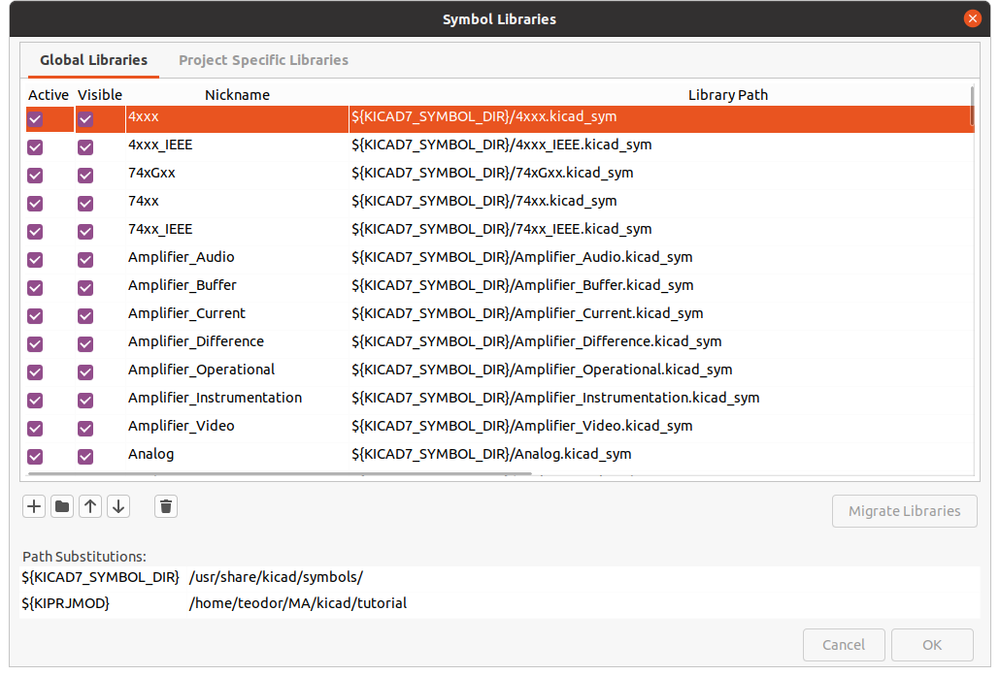
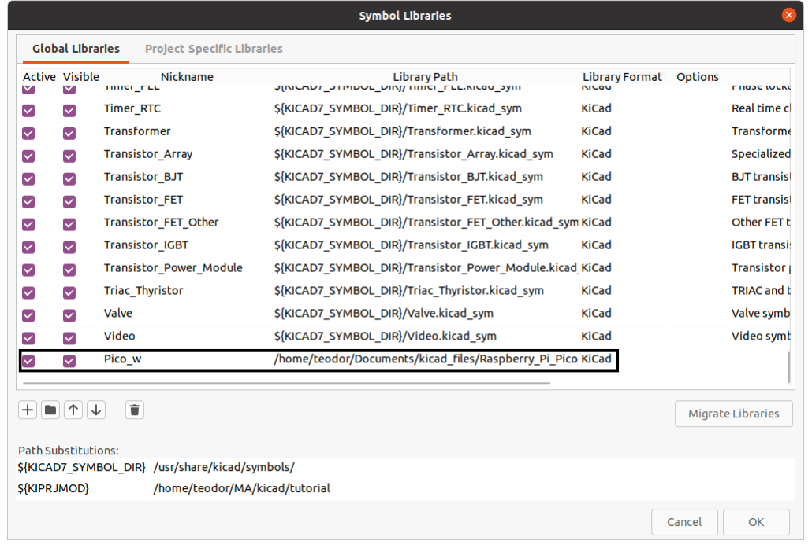
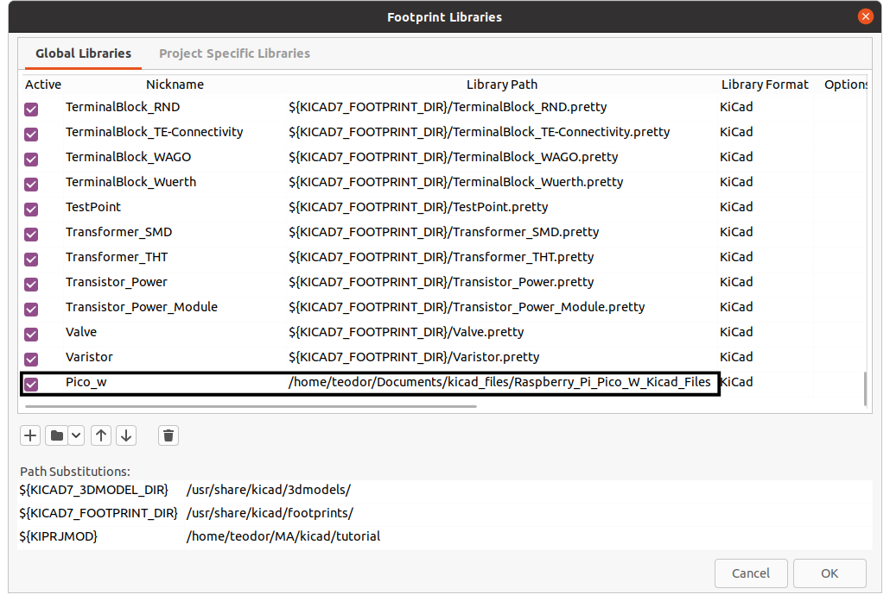
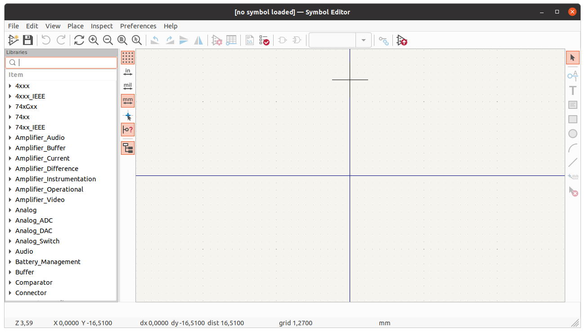
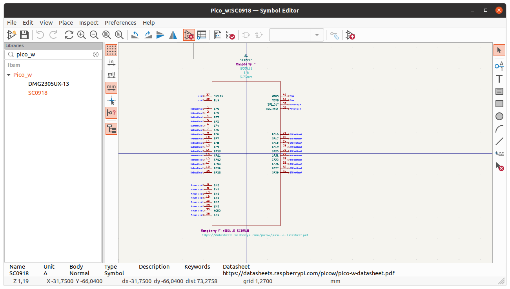
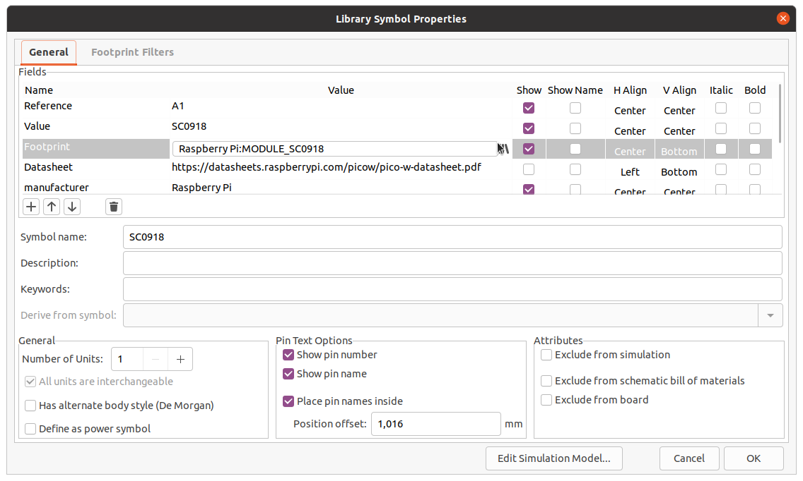
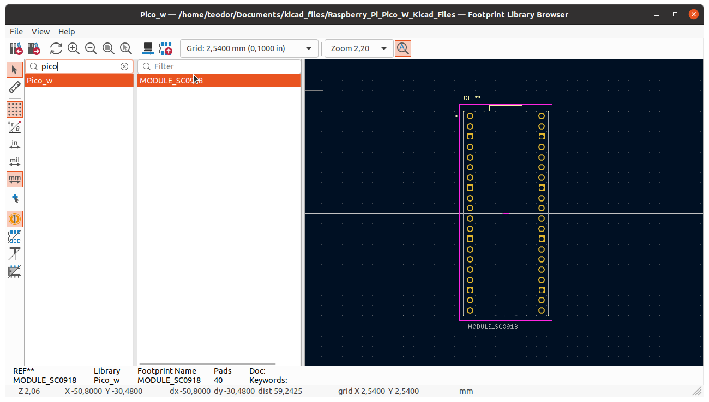
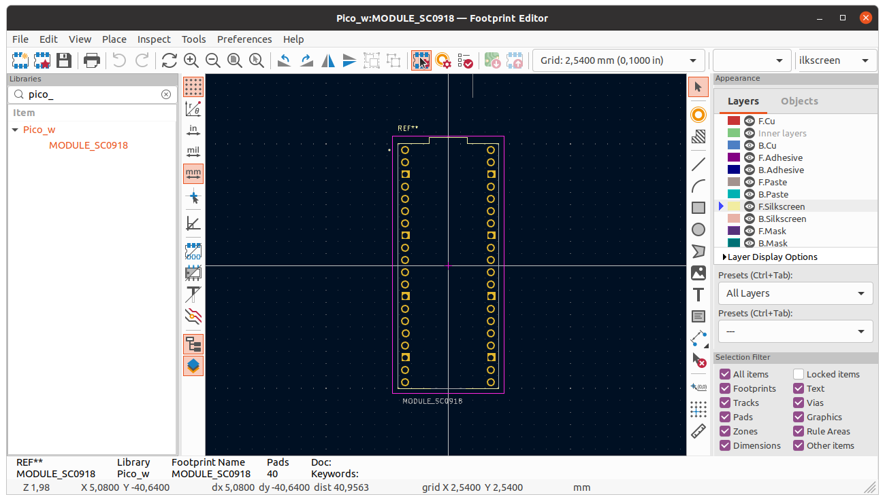
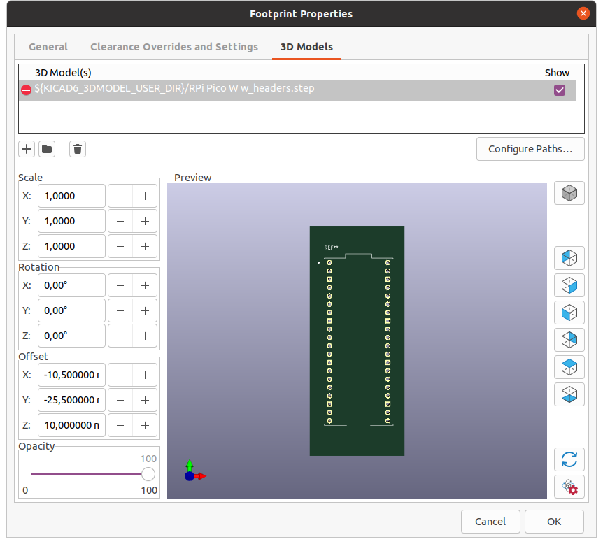
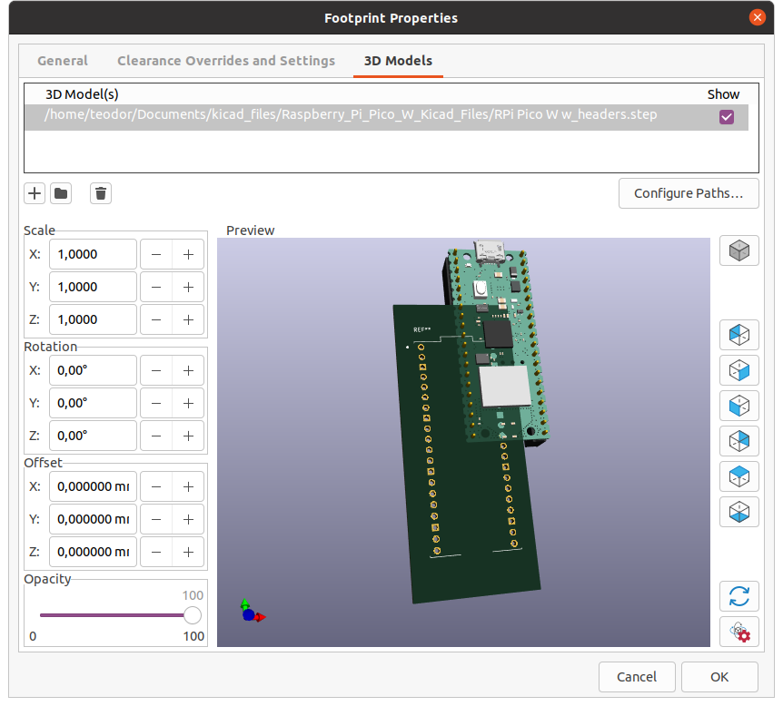

# KiCad setup
In this tutorial you will learn how to setup your computer for KiCad and create electric schematics.

## Resources

1. [KiCad Introduction](https://docs.kicad.org/8.0/en/introduction/introduction.html)
2. [Getting started in KiCad](https://docs.kicad.org/8.0/en/getting_started_in_kicad/getting_started_in_kicad.html)


## What is KiCad?

KiCad is a free and open-source electronics design automation (EDA) suite. It features schematic capture, integrated circuit simulation, printed circuit board (PCB) layout, 3D rendering, and plotting/data export to numerous formats. KiCad also includes a high-quality component library featuring thousands of symbols, footprints, and 3D models. KiCad has minimal system requirements and runs on Linux, Windows, and macOS.

### What is a symbol?

In KiCad, a symbol refers to a graphical representation of an electronic component or device used in a schematic diagram. Symbols are used to represent different types of electronic components such as resistors, capacitors, transistors, integrated circuits, and more. Each symbol typically corresponds to a specific type of electronic component and includes graphical elements that convey information about the component's function and connections.

Symbols in KiCad are part of the schematic design phase. When you create a schematic using KiCad, you place symbols on the schematic sheet and connect them to represent the electrical connections between components. These symbols serve as a visual representation of the electronic circuit you are designing.

### What is a footprint?

In KiCad and in the context of electronic design, a footprint refers to the physical layout or pattern on a printed circuit board (PCB) that corresponds to a specific electronic component's pins and package. Each electronic component, such as resistors, capacitors, integrated circuits, etc., has a specific physical shape and arrangement of pins or pads that need to be accurately represented on the PCB.

The footprint includes information about the component's pin locations, pad sizes, and other details necessary for correctly placing and soldering the component onto the PCB. Creating or selecting the appropriate footprint is crucial for ensuring that the physical components fit correctly onto the PCB and align with the electrical connections specified in the schematic.

Footprints are associated with symbols in the design process. While symbols are used in schematic capture to represent the logical or electrical connections between components, footprints are used in the layout phase to represent the physical layout on the PCB.

## What is a 3D model?

In KiCad, a 3D model refers to a three-dimensional representation of a component or object used in electronic design, specifically for printed circuit board (PCB) layout and visualization. 3D models in KiCad are associated with the footprints of electronic components. These 3D models provide a realistic view of how the physical component will appear on the PCB, aiding in the design and verification process.

## Installation 

You can get KiCad from [here](https://www.kicad.org/download/) for your OS.

## How to add custom schematics, footprints and 3D models

KiCad comes with a standard library that has a wide variety of components. For most project you will only need to import just a bunch of specific integrated circuits or custom components. We will work with a *Raspberry Pi Pico W*, a development board designed around RP2040 microcontroller(MCU). KiCad's standard library has the RP2040 designs, but for the lab work we need to import the development board symbol, footprint and 3D model, as it is not included in the standard library.

### Getting the Raspberry Pi Pico W KiCad files

We can get the symbol, footprint and 3D model of the development board from this git [repository](https://github.com/bdubs-astro/Raspberry_Pi_Pico_W_Kicad_Files.git).

Create a directory where you want to store your downloaded design files and clone the repository there.

```
git clone https://github.com/bdubs-astro/Raspberry_Pi_Pico_W_Kicad_Files.git
```

### Import the symbol

Open the Symbol Libraries manager by clicking `Preferences` -> `Manage Symbol Libraries...`.

<div align="center">

</div>

Click the `+` icon and give your symbol a nickname and the path to the `.kicad_sym` file.

<div align="center">

</div>

:::info
Give your symbol an suitable nickname. This nickname will be the keyword you search for when you want to use it in your schematics.
:::

:::note
You can move your `.kicad_sym` file to the predefined symbol directory and use the relative path as shown for the rest of the components. The predefined symbol directory is created on KiCad's installation phase.
:::

### Import the footprint

Open the Symbol Libraries manager by clicking `Preferences` -> `Manage Footprint Libraries...`.

Click the `+` icon and give your footprint the same nickname as the symbol and the path to the design files **directory**.

<div align="center">

</div>

:::info
Giving the footprint and symbol the same nickname will automatically link them, in most cases. In some cases, due to the `.kicad_sym` configuration, the symbol is linked with a predefined footprint that probably is not in your footprint library. In these cases you have to manually link them.
:::

#### Manual link

In KiCad Project Manager click on `Symbol editor` and search for your symbol.

<div align="center">

</div>

<div align="center">

</div>

After selecting the symbol, click on `Symbol properties` icon highlighted below.

<div align="center">

</div>

In this dialog edit the footprint linked with the symbol with the one you imported.

<div align="center">

</div>

<div align="center">

</div>

Double click on the footprint -> `OK` in the `Symbol properties` dialog -> `Save` in `Symbol editor` dialog.

### Import 3D model

KiCad gives us an extra feature that allows us to have an idea of how our PCB would look like. Some footprints have 3D models predefined but for custom ones we need to import them.

In KiCad Project Manager click on `Footprint editor` and search for your footprint. After selecting the footprint, click on `Footprint properties` icon highlighted below.

<div align="center">

</div>

In `Footprint properties` dialog go to `3D Model`.

<div align="center">

</div>

Delete the old 3D model and add the path to the `.step` file downloaded earlier.

<div align="center">

</div>

Use the `Offset` section to place the component in the right place.

<div align="center">

</div>

Click -> `OK` -> `Save changes`.

Now you are all good to go to design your first circuit with the Raspberry Pi Pico W!

## How to create a new project

The first thing you do when starting a new design is to create a new project. Open Kicad, click `File`->`New Project`, browse to your desired location and give your project a name. 

<div align="center">

</div>

A project contains three types of files:
- a file with the extension `.kicad_pro`
- a schematic file with the extension `.kicad_sch`
- a board file with the extension `.kicad_pcb`. 

The project files all share the name of your project.

:::info
A project uses the state of symbol, footprint and 3D model libraries at its creation. If you want to add new components in an existing project, in `Schematic Editor` and `PCB Editor` click on `Preferences` -> `Manage Symbol libraries...` / `Manage Footprint libraries...` and do the same steps as shown above.
:::
